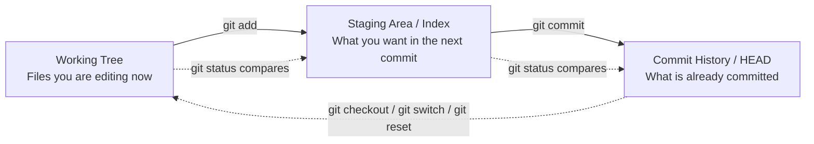
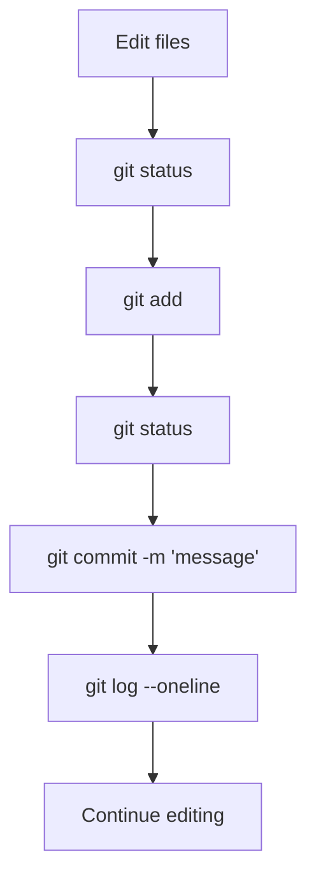
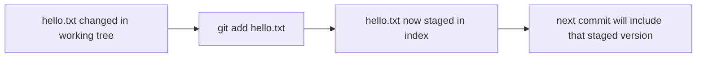
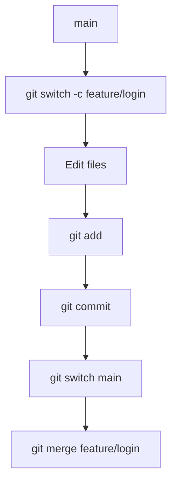

# Git Beginner Workflow

This page is intentionally different from the rest of the `Git Teaching` track.

Most pages in this section explain Git from the inside out: objects, index structure, commit graphs, merge logic, and packfiles. That is the right long-term way to understand Git, but it is not always the best first experience for a beginner who simply wants to know:

- what Git is for,
- what commands they actually run every day,
- what order those commands usually come in,
- what the common mistakes are,
- and how to build a correct mental model without drowning in internals on day one.

This page is the bridge.

It teaches a practical Git workflow first, while still explaining enough of the internal model that the commands do not feel magical.

## What Git Is Solving

At a beginner level, Git solves a very practical set of problems:

- How do I track changes to my files over time?
- How do I save meaningful checkpoints?
- How do I experiment without destroying the current version?
- How do I come back to earlier states?
- How do I collaborate with others or synchronize repositories?

Git is not just "save history." It is a system for managing changing snapshots of a project.

The important word there is **snapshot**.

Git is not mainly storing "a list of edits" in the way many beginners imagine. It is recording snapshots of repository state and the relationships between those snapshots.

## The Most Important Beginner Model

Before looking at commands, hold on to this three-layer model:



If you understand only this diagram, you are already ahead of many beginners.

It means:

- you edit files in the **working tree**,
- you choose what belongs in the next commit by putting it in the **staging area**,
- `git commit` turns the staged state into a new committed snapshot,
- `git status` helps you see which layer differs from which.

## The Daily Beginner Workflow In One Picture

The simplest normal Git loop looks like this:



This may look small, but it is the foundation of almost everything else.

## Step 1: Start Or Open A Repository

If you are creating a repository from scratch:

```bash
git init
```

That creates the repository metadata directory and tells Git, "this folder is now a version-controlled project."

If the repository already exists somewhere else, you normally copy it with:

```bash
git clone <remote-url>
```

For absolute beginners, the main difference is simple:

- `git init` starts a brand-new repository in the current folder,
- `git clone` downloads an existing repository.

## Step 2: Change Files

Now you edit files just like normal. Create a file, change a file, rename something, or delete something.

At this point, Git has not "saved" your work yet. The file system has changed, but the repository history has not.

This is where many beginners need to pause and remember:

editing a file does **not** automatically create a commit.

## Step 3: Use `git status`

The most useful beginner command is:

```bash
git status
```

If you build only one good Git habit, let it be this:

- edit files,
- run `git status`,
- stage changes,
- run `git status` again,
- commit only when the staged set matches what you really want.

Why is this habit so important?

Because it keeps Git visible. Instead of hoping Git "understood what you meant," you are constantly checking its view of repository state.

## Step 4: Use `git add`

This is the step beginners misunderstand most often.

`git add` does **not** mean:

- "save forever,"
- "create a commit,"
- or "push my changes."

It means:

**take the current content of these paths and place them into the staging area as candidates for the next commit.**

### Add One File

```bash
git add hello.txt
```

This is the safest mental starting point. You are deliberately saying:

"I want the current state of `hello.txt` in the next commit."

### Add More Than One Specific File

```bash
git add file1.txt file2.txt
```

Use this when you already know which files belong together in one logical change.

### Add Everything Under The Current Directory

```bash
git add .
```

This is convenient, but beginners often overuse it.

The problem is simple:

- it stages more than you intended,
- it hides which change you are actually about to commit,
- and it encourages sloppy commit boundaries.

You should not fear `git add .`, but you should not use it blindly. Run `git status` immediately after.

### What Happens Mentally When You Run `git add`

Use this picture:



That is all `git add` is doing. It is updating the next commit candidate.

## Step 5: Commit

Once the staging area contains the exact snapshot you want, you create a commit:

```bash
git commit -m "add hello page"
```

This means:

- Git reads the staged snapshot,
- Git creates a new commit object,
- the current branch now points to that new commit.

A commit message should describe the change clearly enough that future you can understand why this checkpoint exists.

Bad beginner habit:

- "update"
- "fix"
- "changes"

Better:

- "add login form validation"
- "rename settings panel to preferences"
- "fix merge conflict in config parser"

## Step 6: Inspect History

A beginner-friendly history command is:

```bash
git log --oneline
```

This gives you a compact view of your commits. It is a good way to confirm:

- your commit was created,
- the message is readable,
- the current branch is moving forward as expected.

## The Basic Local Loop

Here is the full minimal loop again:

```bash
git init
echo "hello" > hello.txt
git status
git add hello.txt
git status
git commit -m "add hello"
git log --oneline
```

If a beginner can explain what happens at each of those steps, they already understand the core of day-to-day Git.

## Branches For Beginners

Sooner or later, beginners hear "make a branch first."

That advice is good, but it helps to understand what a branch really is:

a branch is just a movable name pointing at a commit.

### Create A Branch

```bash
git branch dev
```

This creates a new branch name called `dev`.

### Switch To A Branch

```bash
git switch dev
```

Older tutorials often use:

```bash
git checkout dev
```

Both are common, but `git switch` is easier for beginners to read because it focuses specifically on branch movement.

### Create And Switch In One Step

```bash
git switch -c feature/login
```

This is a very common and useful pattern.

## Beginner Branch Workflow



This is the first real "feature branch" workflow many developers use every day.

## Merge For Beginners

At a beginner level, `git merge` means:

"take the work from another branch and combine it into the branch I am on now."

Example:

```bash
git switch main
git merge dev
```

This means:

- switch to `main`,
- merge the `dev` branch into `main`.

Sometimes Git can merge automatically. Sometimes it cannot.

If the same part of the same file changed in incompatible ways, Git may produce a conflict and ask you to resolve it manually.

## What A Conflict Means

A conflict does **not** mean Git is broken.

It means Git cannot safely decide which overlapping change reflects your real intent.

Beginner rule:

1. read the conflict markers,
2. edit the file to the final desired content,
3. run `git add <file>` again,
4. finish the commit or merge flow.

That last `git add` step matters. It tells Git the conflict has been resolved in the working tree and the resolved file should now replace the conflict state in the index.

## Restore, Reset, And Stash

Beginners also need a small survival kit for messy situations.

### Restore A File From Committed State

Depending on workflow and Git version, people may use commands such as:

```bash
git checkout -- path/to/file
```

or newer restore-oriented flows.

The idea is simple:

"throw away my current working-tree change for this path and go back to a known state."

### Reset

`git reset` changes what your branch and/or staging area point to, depending on mode.

For a beginner:

- `--soft` moves the branch pointer only,
- `--mixed` moves the branch and resets the staging area,
- `--hard` also rewrites the working tree.

The only one that should make you immediately careful is:

```bash
git reset --hard
```

That is a destructive command. Use it only when you understand exactly what state you are discarding.

### Stash

If you have local changes but need to switch context quickly:

```bash
git stash push -m "work in progress"
```

Later:

```bash
git stash pop
```

This is useful when you are not ready to commit but do not want the current working tree blocking a branch switch.

## Remote Basics

Once your local workflow makes sense, the next concepts are:

- `clone`
- `fetch`
- `push`

### Clone

```bash
git clone <remote-url>
```

Copy an existing repository.

### Fetch

```bash
git fetch
```

Download new remote repository information without automatically merging it into your current branch.

### Push

```bash
git push
```

Send your local branch movement and related objects to the remote repository.

At a beginner level, the main thing to remember is:

- `fetch` brings remote updates toward you,
- `push` sends your local updates outward.

## Common Beginner Mistakes

### 1. Using `git add .` Without Looking

This often stages unrelated edits, generated files, or work in progress that should not be part of the same commit.

### 2. Not Running `git status`

This is the fastest way to become confused about what Git thinks is staged, modified, deleted, or untracked.

### 3. Writing Weak Commit Messages

If every commit message is "update" or "fix," history becomes much less useful.

### 4. Committing Too Many Unrelated Changes Together

A commit should usually represent one coherent reason for change.

### 5. Treating Conflicts As Random Chaos

Conflicts are not random. They are a visible sign that Git needs a human decision about overlapping intent.

## How This Page Connects To The Rest Of Git Teaching

This page teaches the practical workflow first.

The rest of the `Git Teaching` section explains **why** the workflow works:

- `Git Object Model` explains objects and content addressing,
- `Index and Staging` explains the staging area in more structural detail,
- `Commits and DAG` explains history and branches,
- `Merge Conflict` explains three-way merge logic,
- `Packfile` explains efficient storage and transfer.

If you are a beginner, start here.

If you want the deeper mental model behind the commands, continue into the rest of the track.
