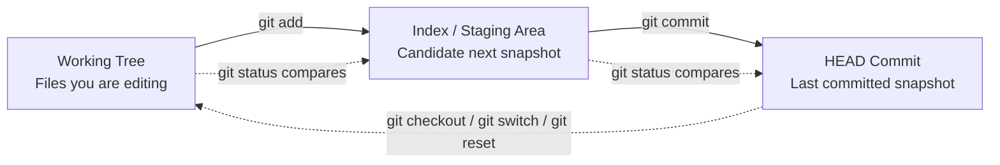

# Index and Staging

Many beginners misunderstand `git add` because they think it "commits a file." It does not. It stages a repository state change.

## A Quick Mental Model

Before going deeper, keep this picture in mind:



This diagram captures the main idea:

- you edit files in the working tree,
- `git add` moves their current state into the staging area,
- `git commit` turns the staged state into a new commit,
- `git status` helps you see the differences between those layers.

## Why The Index Exists

Without a staging area, Git would only compare the current working tree directly against the last commit. That would remove an important capability:

the ability to choose exactly which current changes belong in the next commit.

The index gives Git a third state layer:

- `HEAD`: the last committed snapshot,
- `index`: the next candidate snapshot,
- working tree: the files you are editing right now.

That separation allows Git to express:

- modified but unstaged,
- staged but uncommitted,
- committed,
- conflicted.

## The Index Is A Real Binary Structure

The index is not just a conceptual to-do list. In this project, it is treated as a real Index V2 binary file.

It stores data such as:

- timestamps,
- device and inode metadata,
- mode,
- uid and gid,
- file size,
- the staged blob object ID,
- flags and stage bits,
- path names,
- a trailing checksum.

That is why the index is better understood as a binary staging-state machine than as a simple list.

## What `add` Really Does

When you run `add`, Git-like behavior typically involves:

1. reading the file from the working tree,
2. encoding it as a blob,
3. computing the blob object ID,
4. writing the blob into the object database,
5. updating or inserting the path entry in the index.

The commit has not happened yet. The candidate next snapshot has merely been updated.

## How To Use `git add`

For a beginner, the most useful way to think about `git add` is:

`git add` tells Git, "take the current content of this file and include it in the next commit candidate."

Common usage patterns:

### Add One File

```bash
git add hello.txt
```

Use this when you want to stage only one file's current state.

### Add Multiple Files

```bash
git add file1.txt file2.txt
```

Use this when you want to stage a selected set of files together.

### Add Everything Under The Current Directory

```bash
git add .
```

This is convenient, but it is also easier to over-stage files you did not mean to include. Beginners should use it carefully and check `git status` right after.

## What The Staging Area Means In Everyday Use

The staging area, also called the index, is the answer to a simple workflow problem:

You may have changed several files, but not all of those changes belong in the next commit.

The index lets you say:

- "this file is ready for the next commit,"
- "this file is still being edited,"
- "this conflict is not resolved yet."

That is why `git add` is not the same as `git commit`. It only updates the staged candidate snapshot.

## A Minimal Example

Here is the smallest practical flow:

```bash
echo "hello" > hello.txt
git status
git add hello.txt
git status
git commit -m "add hello"
git status
```

What you should see conceptually:

1. After editing the file, it appears as unstaged.
2. After `git add`, it appears as staged.
3. After `git commit`, the working tree and `HEAD` line up again.

## Why `git status` Is Your Best Companion

Beginners often run `git add` and then feel unsure about what changed in Git's internal state. The best habit is simple:

- change files,
- run `git status`,
- run `git add`,
- run `git status` again,
- commit only when the staged set matches your intention.

That habit makes the staging area visible instead of mysterious.

## Why `status` Needs Three Comparisons

Once the index exists, status becomes a three-way comparison problem:

1. `HEAD` vs `index`
2. `index` vs working tree
3. working tree paths not represented in the index

That is why Git can distinguish staged changes, unstaged changes, and untracked files so precisely.

## Why Conflicts Also Touch The Index

During merge conflicts, the index can carry multiple stages for the same path:

- Stage 1: base
- Stage 2: ours
- Stage 3: theirs

This means conflicts are not only visible in working-tree marker text. They also exist in repository metadata.

Understanding the index is one of the most important steps in moving from "Git commands I memorized" to "Git state transitions I actually understand."
