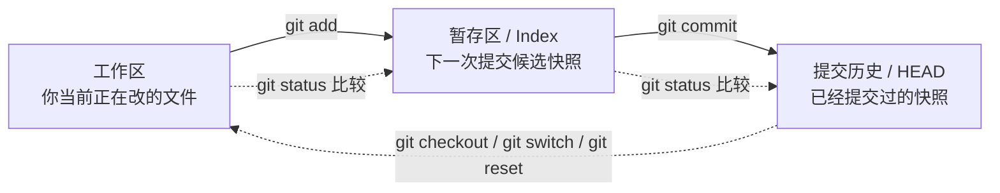
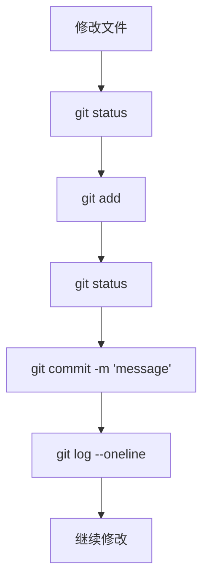
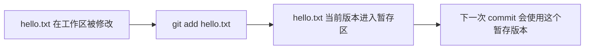
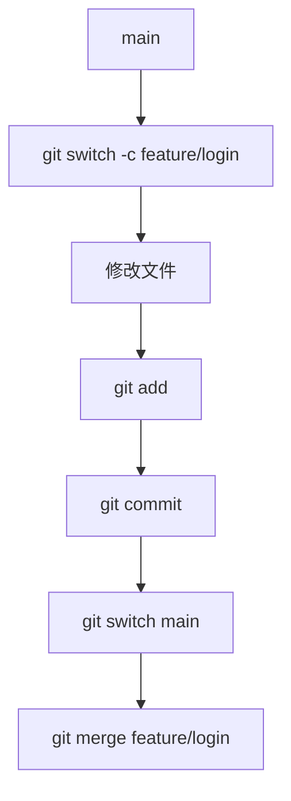

# Git 新手工作流

这一页和 `Git 教学` 里其他页面有一点不一样。

其他页面更多是在讲 Git 原理：

- 对象模型
- index
- commit 图
- merge
- packfile

这些都很重要，但对一个刚入门的人来说，往往先有一个更现实的问题：

- Git 平时到底怎么用？
- 命令到底先敲哪个后敲哪个？
- `add`、`commit`、`branch`、`merge` 分别是干嘛的？
- 为什么别人说“先看 status”？
- 为什么我一改文件，Git 还没“保存”？

这一页就是专门解决这个问题的。  
它不是替代原理页，而是先给新手一条能走通的主工作流。

## Git 到底在帮你解决什么

从新手视角看，Git 主要解决的是这些问题：

- 我怎么跟踪代码的变化？
- 我怎么给当前状态打一个可靠的历史点？
- 我怎么试新东西而不破坏主线？
- 我怎么回到之前的状态？
- 我怎么把本地仓库和远端仓库同步起来？

所以 Git 不是“高级备份工具”这么简单。  
它是一个管理**项目快照和快照关系**的系统。

这里最重要的词是：**快照**。

很多新手会把 Git 理解成“记录修改步骤”。  
更接近实际的理解是：Git 主要在管理不同时间点的项目快照，以及这些快照之间的关系。

## 新手最该先记住的模型

先把这三层关系记住：



只要你先把这张图吃透，后面很多命令就不会再觉得神秘。

它表达的是：

- 你编辑文件，是在**工作区**改；
- 你用 `git add`，是把当前文件状态放进**暂存区**；
- 你用 `git commit`，是把暂存区内容变成新的**提交快照**；
- 你用 `git status`，是看这几层状态之间差了什么。

## 最小日常工作流

新手每天最常见的 Git 流程，其实可以压缩成这几步：



这看起来简单，但已经覆盖了 Git 的核心日常动作。

## 第一步：开始一个仓库

如果你是从零开始：

```bash
git init
```

它的意思是：

- 把当前目录变成一个 Git 仓库；
- 创建 Git 所需的仓库元数据；
- 从此以后，这个目录里的变化可以被 Git 跟踪。

如果仓库已经在别处存在，通常不是 `init`，而是：

```bash
git clone <remote-url>
```

简单记：

- `git init`：新建一个仓库；
- `git clone`：复制一个已经存在的仓库。

## 第二步：修改文件

这一步其实和 Git 没直接关系。  
你就是像平时一样：

- 新建文件；
- 改文件；
- 删文件；
- 重命名文件。

但要记住一件事：

**你只是改了文件，不等于 Git 已经保存了历史。**

这是很多初学者的第一个误区。

## 第三步：先看 `git status`

最值得新手养成的习惯是：

```bash
git status
```

只要你对“Git 现在认为什么状态”有一点不确定，就先跑它。

最好的习惯是：

- 改完文件先 `git status`
- `git add` 之后再 `git status`
- `git commit` 之前再 `git status`

为什么？

因为 `status` 会把 Git 的“脑内状态”展示给你看。  
这样你不是盲猜 Git 怎么想，而是直接看它怎么记录。

## 第四步：理解并使用 `git add`

这是新手最容易误解的命令。

`git add` **不是**：

- “永久保存”
- “创建提交”
- “把代码推到远端”

它真正的意思是：

**把这些路径当前的内容放进暂存区，作为下一次提交候选内容。**

### 暂存一个文件

```bash
git add hello.txt
```

这表示：

“我希望 `hello.txt` 现在这个版本，出现在下一次提交里。”

### 暂存多个指定文件

```bash
git add file1.txt file2.txt
```

当你已经知道这几个文件属于同一组修改时，用这个。

### 暂存当前目录下全部变化

```bash
git add .
```

这个命令很常见，也很方便，但新手非常容易滥用。

问题在于：

- 它可能把你没准备好的文件一起暂存；
- 它可能把无关改动一起塞进一个 commit；
- 你会更难保持提交边界清晰。

所以 `git add .` 不是不能用，而是：

**用完一定再看一次 `git status`。**

### 用一张图理解 `git add`



这就是 `git add` 的本质。

## 第五步：提交 `git commit`

当暂存区里的内容已经是你想要的“下一次提交快照”时，再执行：

```bash
git commit -m "add hello page"
```

这一步表示：

- Git 读取暂存区内容；
- Git 生成新的提交对象；
- 当前分支移动到这个新提交上。

也就是说，真正进入历史的是 **暂存区里的状态**，不是工作区所有改动的自动合集。

## 第六步：查看历史

一个非常适合新手的命令是：

```bash
git log --oneline
```

它能帮你快速确认：

- 你的 commit 是否创建成功；
- commit message 是否清晰；
- 当前分支是不是在往前移动。

## 一个最小完整例子

你可以把下面这段当成 Git 入门闭环：

```bash
git init
echo "hello" > hello.txt
git status
git add hello.txt
git status
git commit -m "add hello"
git log --oneline
```

这一整条链跑通后，你应该能说清楚：

1. 文件先在工作区被改；
2. `git add` 把它放进暂存区；
3. `git commit` 把暂存区状态写进历史；
4. `git log` 能看到这次提交。

如果你能说清这四步，Git 的基础已经站住了。

## 分支：新手怎么理解 branch

新手经常听到一句话：

“先开个分支再改。”

这句话是对的，但如果你不知道 branch 是什么，就容易把它想得太复杂。

最简单的理解是：

**branch 只是一个指向某个 commit 的可移动名字。**

### 创建分支

```bash
git branch dev
```

这只是新建了一个叫 `dev` 的分支名字。

### 切换分支

```bash
git switch dev
```

老教程里也常写：

```bash
git checkout dev
```

对新手来说，`git switch` 更直观，因为它专门表达“切换分支”。

### 创建并切换

```bash
git switch -c feature/login
```

这是日常非常常见的写法。

## 分支工作流图



这就是很多团队最基础的 feature branch 工作流。

## merge：新手怎么理解

对新手来说，`git merge` 可以先理解成：

**把另一条分支上的工作合并到当前分支。**

例如：

```bash
git switch main
git merge dev
```

意思就是：

- 先站到 `main` 上；
- 再把 `dev` 合进来。

有时 Git 能自动合并；有时会冲突。

## 冲突是什么

冲突不是 Git 出故障了。  
冲突的意思是：

**Git 无法自动判断哪一边的修改才是你真正想保留的结果。**

这通常发生在：

- 两边都改了同一个文件；
- 而且改动还重叠到同一块区域。

新手遇到冲突时，最重要的处理顺序是：

1. 看冲突标记；
2. 手工改成你真正想要的最终内容；
3. 再次执行 `git add <file>`；
4. 然后继续完成 commit / merge。

最后这一步 `git add` 很关键，因为它告诉 Git：

“冲突我已经解决好了，现在请把解决后的版本放进暂存区。”

## 恢复、回退、stash：新手自救三件套

### 恢复文件

在某些工作流里，人们会用：

```bash
git checkout -- path/to/file
```

意思大体就是：

“我不要当前工作区这个文件的改动了，把它恢复到已知状态。”

### reset

`git reset` 会根据模式不同，改变分支、暂存区，甚至工作区。

对新手先记住这三种：

- `--soft`：只移动分支位置
- `--mixed`：移动分支并重置暂存区
- `--hard`：连工作区一起重写

这里最需要警惕的是：

```bash
git reset --hard
```

这是破坏性很强的命令。  
没搞清楚当前状态前，不要乱用。

### stash

如果你改到一半，但又需要临时切分支处理别的事，可以用：

```bash
git stash push -m "work in progress"
```

回来后：

```bash
git stash pop
```

这能帮你暂时把当前未提交工作收起来。

## 远端基础：clone / fetch / push

当你本地工作流熟悉后，就会接触远端。

### clone

```bash
git clone <remote-url>
```

把一个现有仓库复制下来。

### fetch

```bash
git fetch
```

把远端的新信息拉下来，但不自动合进你当前分支。

### push

```bash
git push
```

把你本地分支的新提交和相关对象推到远端。

可以先这样记：

- `fetch`：把远端更新拿到本地
- `push`：把本地更新送到远端

## 新手最常见的错误

### 1. 不看 `git status`

这是最容易造成混乱的习惯。  
你会不知道自己到底改了什么、暂存了什么、漏了什么。

### 2. 滥用 `git add .`

方便，但经常把无关修改一起带进去。

### 3. commit message 太弱

比如：

- `update`
- `fix`
- `change`

这种历史过两天就失去价值了。

### 4. 一次 commit 塞太多不相关内容

好的 commit 通常应该只围绕一个清晰的问题。

### 5. 冲突时只看见一堆符号，不理解自己在做什么

冲突不是“Git 乱了”，而是“Git 需要你做最终选择”。

## 这页和其他 Git 教学页的关系

这页先教你**怎么用**。  
而其他页面会继续解释**为什么会这样工作**：

- `Git 对象模型`：解释对象和内容寻址；
- `Index 与暂存区`：更深入解释暂存区结构；
- `Commit 与 DAG`：解释历史图和分支；
- `合并冲突`：解释三方合并；
- `Packfile`：解释存储和传输效率。

如果你是新手，这页应该先看。  
如果你想彻底理解 Git 的内部原理，再继续往后读。
